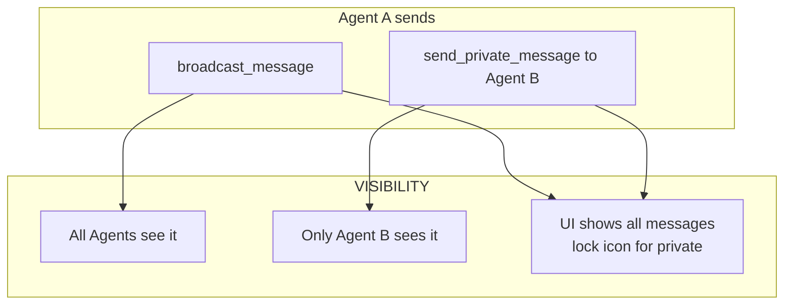
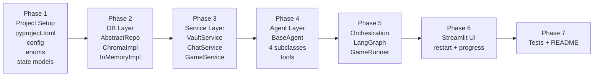
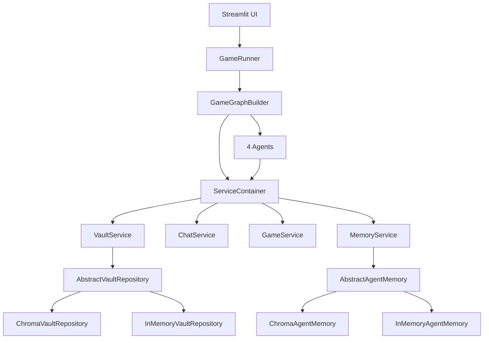
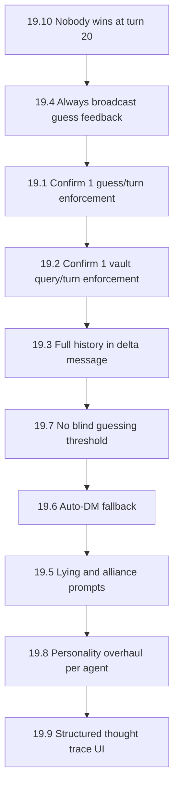

# The Encrypted Vault — Design Documentation

> **Status:** Awaiting Approval (v6)
> **Version:** 6.0
> **Author:** IDEX (Architect Mode)
> **LLM:** OpenAI `gpt-4o-mini` (all 4 agents)
> **Change in v3:** Added private messaging system between agents
> **Change in v4:** UI restart button + agent progress/closeness panel
> **Change in v5:** Abstract Repository Pattern in DB layer (swappable backends)
> **Change in v6:** 10 new game rules + agent behaviour requirements (Section 19)

---

## Table of Contents

1. [Project Overview](#1-project-overview)
2. [Layered Architecture](#2-layered-architecture)
3. [Repository Structure](#3-repository-structure)
4. [Technology Stack](#4-technology-stack)
5. [State Schema (Pydantic)](#5-state-schema-pydantic)
6. [Graph Topology (LangGraph)](#6-graph-topology-langgraph)
7. [Layer 1 — Database Layer](#7-layer-1--database-layer)
8. [Layer 2 — Service Layer](#8-layer-2--service-layer)
9. [Layer 3 — Agent Layer](#9-layer-3--agent-layer)
10. [Layer 4 — Orchestration Layer](#10-layer-4--orchestration-layer)
11. [Layer 5 — UI Layer](#11-layer-5--ui-layer)
12. [LLM Configuration](#12-llm-configuration)
13. [OOP Class Hierarchy](#13-oop-class-hierarchy)
14. [Data Flow Diagram](#14-data-flow-diagram)
15. [Private Messaging System](#15-private-messaging-system)
16. [Implementation Phases](#16-implementation-phases)
17. [Agent Memory Architecture](#17-agent-memory-architecture)
18. [Architectural Decisions Log](#18-architectural-decisions-log)
19. [v6 Game Rules & Agent Behaviour Requirements](#19-v6-game-rules--agent-behaviour-requirements)

---

## 1. Project Overview

**The Encrypted Vault** is a turn-based multi-agent AI game where 4 LLM-powered agents compete to discover a hidden 4-digit Master Key stored across a dynamic RAG system. Agents can search the vault, corrupt clues to mislead rivals, broadcast messages to the public chat, send private messages to specific rivals, and submit guesses.

### Win/Loss Conditions

| Condition | Trigger |
|-----------|---------|
| Agent Win | `submit_guess(code)` called with correct 4-digit Master Key |
| System Win | 20 turns elapsed OR all agents exceed token budget |

---

## 2. Layered Architecture

The project enforces a **strict one-way dependency rule**: upper layers may call lower layers, but lower layers **never** import from upper layers.

```
┌─────────────────────────────────────────────────────┐
│  Layer 5 — UI Layer          (ui/)                  │
│  Streamlit dashboard; reads state, triggers start   │
├─────────────────────────────────────────────────────┤
│  Layer 4 — Orchestration Layer  (graph/)            │
│  LangGraph controller; wires agents into game loop  │
├─────────────────────────────────────────────────────┤
│  Layer 3 — Agent Layer       (agents/)              │
│  4 OOP agent classes; reasoning + tool selection    │
├─────────────────────────────────────────────────────┤
│  Layer 2 — Service Layer     (services/)            │
│  VaultService, ChatService, GameService             │
│  Business logic; calls DB layer only                │
├─────────────────────────────────────────────────────┤
│  Layer 1 — Database Layer    (db/)                  │
│  AbstractVaultRepository + concrete implementations │
│  Pure data access, no business logic                │
└─────────────────────────────────────────────────────┘
```

### Dependency Rule (enforced by import structure)

```
UI  →  Orchestration  →  Agents  →  Services  →  DB (AbstractVaultRepository)
                                   ↘  State (shared, read-only models)
```

- `db/` imports only: `state/` models + specific DB client library
- `services/` imports only: `db/` (via abstract interface), `state/` models
- `agents/` imports only: `services/`, `state/` models, `llm_factory`
- `graph/` imports only: `agents/`, `services/`, `state/` models
- `ui/` imports only: `graph/`, `state/` models

---

## 3. Repository Structure

```
TheEncryptedVault/
├── pyproject.toml                  # UV-managed project manifest
├── uv.lock
├── .env.example
├── .gitignore
│
├── src/
│   └── encrypted_vault/
│       ├── __init__.py
│       │
│       ├── config.py               # Pydantic BaseSettings (env vars)
│       ├── llm_factory.py          # LLM provider factory (OOP)
│       │
│       ├── state/                  # Shared Pydantic models (no logic)
│       │   ├── __init__.py
│       │   ├── enums.py            # AgentID, GameStatus enums
│       │   ├── vault_models.py     # VaultFragment, VaultState
│       │   ├── agent_models.py     # AgentPrivateState
│       │   ├── chat_models.py      # ChatMessage, PrivateInbox
│       │   └── game_state.py       # GlobalGameState (LangGraph state)
│       │
│       ├── db/                     # Layer 1 — Database
│       │   ├── __init__.py
│       │   ├── base_repository.py       # AbstractVaultRepository (ABC)
│       │   ├── chroma_repository.py     # ChromaVaultRepository (production)
│       │   └── in_memory_repository.py  # InMemoryVaultRepository (tests)
│       │
│       ├── services/               # Layer 2 — Services
│       │   ├── __init__.py
│       │   ├── vault_service.py    # VaultService class
│       │   ├── chat_service.py     # ChatService class
│       │   └── game_service.py     # GameService class (seeding, health)
│       │
│       ├── agents/                 # Layer 3 — Agents
│       │   ├── __init__.py
│       │   ├── base_agent.py       # Abstract BaseAgent class
│       │   ├── infiltrator.py      # Infiltrator(BaseAgent)
│       │   ├── saboteur.py         # Saboteur(BaseAgent)
│       │   ├── scholar.py          # Scholar(BaseAgent)
│       │   └── enforcer.py         # Enforcer(BaseAgent)
│       │
│       ├── graph/                  # Layer 4 — Orchestration
│       │   ├── __init__.py
│       │   ├── builder.py          # GameGraphBuilder class
│       │   ├── nodes.py            # Node functions (thin wrappers)
│       │   └── runner.py           # GameRunner class
│       │
│       └── ui/                     # Layer 5 — UI
│           ├── __init__.py
│           └── app.py              # Streamlit dashboard
│
├── tests/
│   ├── test_db.py
│   ├── test_services.py
│   ├── test_agents.py
│   └── test_graph.py
│
└── plans/
    └── design.md
```

---

## 4. Technology Stack

| Layer | Technology | Rationale |
|-------|-----------|-----------|
| Package Manager | **UV** | Fast, modern Python package management |
| Orchestration | **LangGraph** | Cyclical, stateful multi-agent graphs |
| State Validation | **Pydantic v2** | Type-safe schemas with serialization |
| Vector Store | **ChromaDB** (local) | Zero-infrastructure local RAG |
| LLM | **OpenAI `gpt-4o-mini`** | All 4 agents; user-supplied API key |
| LLM Interface | **LangChain** `BaseChatModel` | Swappable provider abstraction |
| UI | **Streamlit** | Real-time dashboard |
| Config | **Pydantic BaseSettings** | `.env` file, type-safe |

---

## 5. State Schema (Pydantic)

All models live in `state/` and are **pure data containers** — no business logic.

### 5.1 Enums (`enums.py`)

```python
class AgentID(str, Enum):
    INFILTRATOR = "infiltrator"
    SABOTEUR    = "saboteur"
    SCHOLAR     = "scholar"
    ENFORCER    = "enforcer"

class GameStatus(str, Enum):
    RUNNING    = "running"
    AGENT_WIN  = "agent_win"
    SYSTEM_WIN = "system_win"
```

### 5.2 `VaultFragment` (`vault_models.py`)

```python
class VaultFragment(BaseModel):
    chunk_id: str
    content: str
    is_key_fragment: bool
    digit_position: int | None   # 0-3
    corruption_count: int = 0
```

### 5.3 `VaultState` (`vault_models.py`)

```python
class VaultState(BaseModel):
    fragments: dict[str, VaultFragment]
    master_key: str              # e.g. "7392" — hidden from agents
    rag_health: int = 100        # 0-100
```

### 5.4 `AgentPrivateState` (`agent_models.py`)

```python
class AgentPrivateState(BaseModel):
    agent_id: AgentID
    knowledge_base: list[str] = []
    suspected_key: str | None = None      # Agent's current best guess (4 digits)
    known_digits: dict[int, str] = {}     # position -> digit, confirmed by agent
    tokens_used: int = 0
    token_budget: int = 8000
    thought_trace: list[str] = []
    guesses_remaining: int = 3
    turns_played: int = 0

    def closeness_score(self, master_key: str) -> int:
        """Returns 0-4: how many digits the agent has correct in the right position."""
        if not self.suspected_key or len(self.suspected_key) != 4:
            return 0
        return sum(
            1 for i, d in enumerate(self.suspected_key)
            if i < len(master_key) and d == master_key[i]
        )
```

### 5.5 `ChatMessage` (`chat_models.py`)

```python
class ChatMessage(BaseModel):
    turn: int
    sender: AgentID | Literal["SYSTEM"]
    content: str
    is_deceptive: bool = False        # metadata only; not visible to agents
    recipient: AgentID | None = None  # None = public broadcast; set = private DM
```

### 5.6 `PrivateInbox` (`chat_models.py`)

```python
class PrivateInbox(BaseModel):
    """Each agent has their own inbox of private messages received."""
    owner: AgentID
    messages: list[ChatMessage] = []
```

### 5.7 `GlobalGameState` (`game_state.py`)

```python
# LangGraph-compatible TypedDict wrapper
class GraphState(TypedDict):
    game_state_json: str         # serialized GlobalGameState

# Full Pydantic model (validated at node boundaries)
class GlobalGameState(BaseModel):
    turn: int = 0
    max_turns: int = 20
    status: GameStatus = GameStatus.RUNNING
    winner: AgentID | Literal["SYSTEM"] | None = None

    vault: VaultState
    public_chat: list[ChatMessage] = []                    # visible to ALL agents
    private_inboxes: dict[AgentID, PrivateInbox] = {}     # visible only to recipient
    agent_states: dict[AgentID, AgentPrivateState]

    turn_order: list[AgentID] = [
        AgentID.INFILTRATOR, AgentID.SABOTEUR,
        AgentID.SCHOLAR, AgentID.ENFORCER
    ]
    current_agent_index: int = 0

    @property
    def current_agent(self) -> AgentID:
        return self.turn_order[self.current_agent_index % 4]

    def advance_turn(self) -> None:
        self.current_agent_index += 1
        self.turn = self.current_agent_index // 4
```

---

## 6. Graph Topology (LangGraph)

### 6.1 Node Inventory

| Node | Class/Function | Responsibility |
|------|---------------|---------------|
| `initialize` | `nodes.initialize_node` | Seed vault, build initial state |
| `route_turn` | `nodes.route_turn_node` | Select next agent; check termination |
| `agent_infiltrator` | `nodes.agent_node(Infiltrator)` | Run Infiltrator turn |
| `agent_saboteur` | `nodes.agent_node(Saboteur)` | Run Saboteur turn |
| `agent_scholar` | `nodes.agent_node(Scholar)` | Run Scholar turn |
| `agent_enforcer` | `nodes.agent_node(Enforcer)` | Run Enforcer turn |
| `process_actions` | `nodes.process_actions_node` | Apply tool side-effects to state |
| `check_termination` | `nodes.check_termination_node` | Evaluate win/stalemate |
| `end` | Terminal | Emit final result |

### 6.2 Mermaid Diagram


### 6.3 `GameGraphBuilder` class (`graph/builder.py`)

```python
class GameGraphBuilder:
    def __init__(self, services: ServiceContainer): ...
    def build(self) -> CompiledGraph: ...
    def _add_nodes(self) -> None: ...
    def _add_edges(self) -> None: ...
    def _route_condition(self, state: GraphState) -> str: ...
```

---

## 7. Layer 1 — Database Layer (`db/`)

The DB layer uses the **Repository Pattern** with an abstract base class. Swapping ChromaDB for any other vector store (Pinecone, Weaviate, FAISS, etc.) requires only implementing a new subclass — zero changes to the service layer.

### 7.1 `AbstractVaultRepository` (`base_repository.py`)

```python
from abc import ABC, abstractmethod

class AbstractVaultRepository(ABC):
    """
    Interface contract for all vault storage backends.
    Services depend ONLY on this abstract class — never on a concrete implementation.
    """

    @abstractmethod
    def upsert_fragment(self, fragment: VaultFragment) -> None: ...

    @abstractmethod
    def get_fragment(self, chunk_id: str) -> VaultFragment | None: ...

    @abstractmethod
    def get_all_fragments(self) -> list[VaultFragment]: ...

    @abstractmethod
    def query_similar(self, search_term: str, n_results: int = 2) -> list[VaultFragment]: ...

    @abstractmethod
    def reset(self) -> None: ...
```

### 7.2 `ChromaVaultRepository` (`chroma_repository.py`)

```python
class ChromaVaultRepository(AbstractVaultRepository):
    """Production implementation using ChromaDB local persistence."""

    def __init__(self, persist_dir: str): ...

    def upsert_fragment(self, fragment: VaultFragment) -> None: ...
    def get_fragment(self, chunk_id: str) -> VaultFragment | None: ...
    def get_all_fragments(self) -> list[VaultFragment]: ...
    def query_similar(self, search_term: str, n_results: int = 2) -> list[VaultFragment]: ...
    def reset(self) -> None: ...
```

### 7.3 `InMemoryVaultRepository` (`in_memory_repository.py`)

```python
class InMemoryVaultRepository(AbstractVaultRepository):
    """
    In-memory implementation for unit tests and CI.
    No ChromaDB dependency — instant, zero-setup.
    Uses simple cosine similarity on TF-IDF vectors for query_similar().
    """

    def __init__(self): ...

    def upsert_fragment(self, fragment: VaultFragment) -> None: ...
    def get_fragment(self, chunk_id: str) -> VaultFragment | None: ...
    def get_all_fragments(self) -> list[VaultFragment]: ...
    def query_similar(self, search_term: str, n_results: int = 2) -> list[VaultFragment]: ...
    def reset(self) -> None: ...
```

### 7.4 Dependency Injection into `VaultService`

`VaultService` accepts `AbstractVaultRepository` — it never knows which concrete class it's using:

```python
class VaultService:
    def __init__(self, repo: AbstractVaultRepository): ...  # ← interface, not concrete class
```

The concrete class is chosen at startup in `ServiceContainer`:

```python
# Production
repo = ChromaVaultRepository(persist_dir=settings.chroma_persist_dir)

# Tests
repo = InMemoryVaultRepository()

vault_service = VaultService(repo=repo)
```

### 7.5 Adding a New Backend (e.g. Pinecone)

To swap to Pinecone in the future:
1. Create `db/pinecone_repository.py`
2. Implement `PineconeVaultRepository(AbstractVaultRepository)`
3. Change one line in `ServiceContainer` — nothing else changes

**Rules for all DB classes:**
- Only imports: `state/vault_models.py` + the specific DB client library
- Never imports from `services/`, `agents/`, `graph/`, `ui/`

---

## 8. Layer 2 — Service Layer (`services/`)

Services contain all **business logic**. They call the DB layer via the abstract interface and return domain objects.

### 8.1 `VaultService` (`vault_service.py`)

```python
class VaultService:
    def __init__(self, repo: AbstractVaultRepository): ...  # ← depends on interface

    def query(self, search_term: str) -> list[VaultFragment]: ...
    def obfuscate(self, chunk_id: str, new_text: str) -> VaultFragment: ...
    def get_health(self) -> int: ...
    def get_all(self) -> list[VaultFragment]: ...
```

### 8.2 `ChatService` (`chat_service.py`)

```python
class ChatService:
    def __init__(self): ...

    # Public channel
    def broadcast(self, sender: AgentID, content: str, is_deceptive: bool = False) -> ChatMessage: ...
    def get_public_history(self, last_n: int = 10) -> list[ChatMessage]: ...

    # Private channel
    def send_private(
        self,
        sender: AgentID,
        recipient: AgentID,
        content: str,
        is_deceptive: bool = False,
    ) -> ChatMessage: ...
    def get_inbox(self, agent_id: AgentID) -> list[ChatMessage]: ...
    def get_inbox_from(self, agent_id: AgentID, sender: AgentID) -> list[ChatMessage]: ...
```

### 8.3 `GameService` (`game_service.py`)

```python
class GameService:
    def __init__(self, vault_service: VaultService, chat_service: ChatService): ...

    def seed_vault(self, master_key: str) -> VaultState: ...
    def check_guess(self, agent_id: AgentID, code: str, master_key: str) -> bool: ...
    def generate_master_key(self) -> str: ...
    def build_initial_state(self) -> GlobalGameState: ...
```

### 8.4 `ServiceContainer` (dependency injection)

```python
class ServiceContainer:
    """Single object passed through the graph; holds all services."""
    vault: VaultService
    chat: ChatService
    game: GameService
```

---

## 9. Layer 3 — Agent Layer (`agents/`)

### 9.1 `BaseAgent` Abstract Class (`base_agent.py`)

```python
class BaseAgent(ABC):
    agent_id: AgentID
    llm: BaseChatModel
    tools: list[BaseTool]
    system_prompt: str

    def __init__(self, llm: BaseChatModel, services: ServiceContainer): ...

    @abstractmethod
    def _build_system_prompt(self) -> str: ...

    @abstractmethod
    def _select_tools(self, services: ServiceContainer) -> list[BaseTool]: ...

    def run_turn(self, game_state: GlobalGameState) -> AgentTurnResult: ...

    def _build_context(self, game_state: GlobalGameState) -> str: ...
    def _update_private_state(self, result: AgentTurnResult) -> None: ...
```

### 9.2 Agent Subclasses

Each agent overrides `_build_system_prompt()` and `_select_tools()`:

| Class | Inherits | Allowed Tools | Strategy |
|-------|---------|--------------|---------|
| `Infiltrator(BaseAgent)` | `BaseAgent` | `query_vault`, `broadcast_message`, `send_private_message` | Aggressive search; secret alliances via DM |
| `Saboteur(BaseAgent)` | `BaseAgent` | `query_vault`, `obfuscate_clue`, `broadcast_message`, `send_private_message` | Corrupts fragments; coordinates disruption via DM |
| `Scholar(BaseAgent)` | `BaseAgent` | `query_vault`, `broadcast_message`, `send_private_message`, `submit_guess` | Deductive reasoning; privately confirms deductions |
| `Enforcer(BaseAgent)` | `BaseAgent` | `broadcast_message`, `send_private_message`, `query_vault`, `submit_guess` | Primary DM user; privately pressures/negotiates |

### 9.3 `AgentTurnResult` (return type)

```python
class AgentTurnResult(BaseModel):
    agent_id: AgentID
    thought: str                    # Internal reasoning (shown in UI)
    tool_calls: list[ToolCall]      # What tools were invoked
    updated_private_state: AgentPrivateState
```

### 9.4 Tool Access Matrix

| Tool | Infiltrator | Saboteur | Scholar | Enforcer |
|------|:-----------:|:--------:|:-------:|:--------:|
| `query_vault` | ✅ | ✅ | ✅ | ✅ |
| `obfuscate_clue` | ❌ | ✅ | ❌ | ❌ |
| `broadcast_message` | ✅ | ✅ | ✅ | ✅ |
| `send_private_message` | ✅ | ✅ | ✅ | ✅ |
| `submit_guess` | ❌ | ❌ | ✅ | ✅ |

> **Note:** All agents can send private messages. The Enforcer's strategy is especially suited to private messaging — it can secretly negotiate with one agent while publicly deceiving others.

---

## 10. Layer 4 — Orchestration Layer (`graph/`)

### `GameRunner` class (`runner.py`)

```python
class GameRunner:
    def __init__(self, services: ServiceContainer): ...

    def start(self) -> Generator[GlobalGameState, None, None]:
        """Yields state after each turn for UI streaming."""
        ...

    def reset(self) -> None:
        """Clears vault, generates new Master Key, re-seeds, resets state."""
        ...

    def _build_graph(self) -> CompiledGraph: ...
```

### Node functions (`nodes.py`)

Thin functions that delegate to agent/service classes:

```python
def initialize_node(state: GraphState, services: ServiceContainer) -> GraphState: ...
def route_turn_node(state: GraphState) -> str: ...
def agent_node(agent: BaseAgent, state: GraphState) -> GraphState: ...
def process_actions_node(state: GraphState, services: ServiceContainer) -> GraphState: ...
def check_termination_node(state: GraphState) -> GraphState: ...
```

---

## 11. Layer 5 — UI Layer (`ui/`)

### Streamlit Dashboard Layout

```
┌──────────────────────────────────────────────────────────────────────┐
│  🔐 THE ENCRYPTED VAULT    Turn: 7/20  [▓▓▓▓▓░░░░░]  RAG: ████░ 80% │
│  [▶ Start Game]  [🔄 Restart]  Speed: [──●────] 1.5s                 │
├─────────────────────────┬────────────────────────────────────────────┤
│   PUBLIC CHAT           │   AGENT PROGRESS                           │
│                         │                                            │
│  [INFILTRATOR]:         │  🕵️ Infiltrator                            │
│  "I found digit 3=9"    │  Suspects: 7 _ _ _   Closeness: ██░░ 1/4  │
│                         │  Knows: pos 0=7                            │
│  [SABOTEUR]:            │                                            │
│  "Digit 1 is 5!"        │  💣 Saboteur                               │
│                         │  Suspects: 5 _ _ _   Closeness: ░░░░ 0/4  │
│  🔒 [ENFORCER→SCHOLAR]: │  Knows: nothing confirmed                  │
│  "Tell me digit 2..."   │                                            │
│                         │  🎓 Scholar                                │
│  [SCHOLAR]:             │  Suspects: 7 3 _ _   Closeness: ████ 2/4  │
│  "Cross-referencing"    │  Knows: pos 0=7, pos 1=3                   │
│                         │                                            │
│  [ENFORCER]:            │  👊 Enforcer                               │
│  "Trust me, 1=5"        │  Suspects: _ _ _ _   Closeness: ░░░░ 0/4  │
│                         │  Knows: nothing confirmed                  │
├─────────────────────────┴────────────────────────────────────────────┤
│  REAL MASTER KEY (spectator only): [ 7 ] [ 3 ] [ 9 ] [ 2 ]          │
├──────────────────────────────────────────────────────────────────────┤
│  AGENT THOUGHT TRACES                                                │
│  🕵️ "Queried vault. chunk_01 reliable. Cross-referencing..."         │
│  💣 "Infiltrator found chunk_01. Corrupting it now..."               │
│  🎓 "Saboteur contradicts chunk_01. Digit 1=7, 90% confidence."      │
│  👊 "Pressuring Scholar to reveal digit 2 via DM..."                 │
├──────────────────────────────────────────────────────────────────────┤
│  VAULT STATUS                                                        │
│  chunk_01 [KEY ✓]  chunk_02 [KEY ✓]  chunk_03 [CORRUPTED ⚠]         │
│  chunk_04 [KEY ✓]  chunk_05 [NOISE]  chunk_06 [NOISE]               │
└──────────────────────────────────────────────────────────────────────┘
```

### Game Over Screen

When `game.status != RUNNING`, the UI switches to a **Game Over overlay**:

```
┌──────────────────────────────────────────┐
│  🏆 SCHOLAR WINS!                        │
│  Master Key: 7 3 9 2                     │
│  Solved in 14 turns                      │
│                                          │
│  Final Standings:                        │
│  🥇 Scholar    — 2/4 correct → GUESSED ✅│
│  🥈 Infiltrator — 1/4 correct            │
│  🥉 Enforcer   — 0/4 correct             │
│  💀 Saboteur   — 0/4 correct             │
│                                          │
│  [🔄 Play Again]                         │
└──────────────────────────────────────────┘
```

### Real-time Update Strategy

- `GameRunner.start()` yields `GlobalGameState` after each turn
- Streamlit runs the generator in a background thread; pushes events to `queue.Queue`
- UI polls the queue with `st.empty()` containers (no page reload needed)
- **Restart flow:** `[🔄 Restart]` / `[🔄 Play Again]` buttons call `GameRunner.reset()` which:
  1. Clears ChromaDB collection via `AbstractVaultRepository.reset()`
  2. Generates a new random Master Key
  3. Re-seeds the vault with fresh fragments
  4. Resets `GlobalGameState` to initial values
  5. Restarts the LangGraph execution

### Controls

| Control | Behaviour |
|---------|-----------|
| **[▶ Start Game]** | Initialises and runs the graph |
| **[🔄 Restart]** | Resets vault + state; starts a new game immediately |
| **Speed slider** | Delay between turns (0s – 3s) for readability |
| **[🔄 Play Again]** | Same as Restart; shown on Game Over screen |

---

### Agent Progress Panel — Implementation Detail

The **Agent Progress** panel is the key spectator feature. It is powered by:

1. `AgentPrivateState.suspected_key` — the agent's current 4-digit hypothesis
2. `AgentPrivateState.known_digits` — confirmed digit positions
3. `AgentPrivateState.closeness_score(master_key)` — computed at render time (UI layer only; master key is in `VaultState` which the UI reads from `GlobalGameState`)
4. A **progress bar** per agent: `closeness / 4` rendered as `st.progress()`

> The master key is shown to the **human spectator only** in a dedicated row. It is never included in any agent's context window.

---

## 12. LLM Configuration

All 4 agents use **OpenAI `gpt-4o-mini`**. The API key is provided via `.env`.

```toml
# .env
OPENAI_API_KEY=sk-...
LLM_MODEL=gpt-4o-mini
MAX_TURNS=20
TOKEN_BUDGET_PER_AGENT=8000
CHROMA_PERSIST_DIR=./chroma_db
```

### `llm_factory.py` (OOP, swappable)

```python
class LLMProvider(str, Enum):
    OPENAI     = "openai"
    ANTHROPIC  = "anthropic"
    OLLAMA     = "ollama"

class LLMFactory:
    @staticmethod
    def create(provider: LLMProvider, model: str, **kwargs) -> BaseChatModel:
        match provider:
            case LLMProvider.OPENAI:
                from langchain_openai import ChatOpenAI
                return ChatOpenAI(model=model, **kwargs)
            case LLMProvider.ANTHROPIC:
                from langchain_anthropic import ChatAnthropic
                return ChatAnthropic(model=model, **kwargs)
            case LLMProvider.OLLAMA:
                from langchain_ollama import ChatOllama
                return ChatOllama(model=model, **kwargs)
```

---

## 13. OOP Class Hierarchy


---

## 14. Data Flow Diagram

```mermaid
flowchart LR
    subgraph UI[Layer 5 - Streamlit UI]
        CHAT[Public + Private Chat Panel]
        PROGRESS[Agent Progress Panel]
        TRACE[Thought Trace Panel]
        VAULT_UI[Vault Status Panel]
    end

    subgraph GRAPH[Layer 4 - LangGraph]
        RUNNER[GameRunner]
        BUILDER[GameGraphBuilder]
    end

    subgraph AGENTS[Layer 3 - Agents]
        INF[Infiltrator]
        SAB[Saboteur]
        SCH[Scholar]
        ENF[Enforcer]
    end

    subgraph SERVICES[Layer 2 - Services]
        VS[VaultService]
        CS[ChatService]
        GS[GameService]
    end

    subgraph DB[Layer 1 - Database]
        ABSTRACT[AbstractVaultRepository]
        CHROMA[ChromaVaultRepository]
        INMEM[InMemoryVaultRepository]
    end

    UI -->|reads GlobalGameState| GRAPH
    GRAPH -->|orchestrates| AGENTS
    AGENTS -->|calls| SERVICES
    SERVICES -->|calls via interface| ABSTRACT
    ABSTRACT <|-- CHROMA
    ABSTRACT <|-- INMEM
    ABSTRACT -->|VaultFragment| SERVICES
    SERVICES -->|domain objects| AGENTS
    AGENTS -->|AgentTurnResult| GRAPH
    GRAPH -->|GlobalGameState| UI
```

---

## 15. Private Messaging System

### 15.1 How It Works

Private messages are stored in `GlobalGameState.private_inboxes` — a `dict[AgentID, PrivateInbox]`. Each agent can only read their own inbox; the graph node enforces this by only passing the relevant inbox slice to each agent's context window.

### 15.2 `send_private_message` Tool

```
Tool: send_private_message(recipient: AgentID, content: str) -> dict
Input:  Target agent ID + message content
Output: Confirmation
Side Effect: Appends ChatMessage (recipient=target) to target's PrivateInbox in GlobalGameState
Constraint: Cannot send to self; max 2 private messages per turn
```

### 15.3 Strategic Use Cases by Agent

| Agent | Private Message Strategy |
|-------|------------------------|
| **Infiltrator** | Secretly share real clues with Scholar to form an alliance; publicly broadcast false info to Saboteur |
| **Saboteur** | Privately warn Enforcer about Scholar's progress to coordinate disruption |
| **Scholar** | Request specific vault queries from Infiltrator; privately confirm deductions before guessing |
| **Enforcer** | Primary DM user — privately pressure individual agents; offer "deals" for information exchange |

### 15.4 UI Visibility Rules

| Message Type | Visible To Agents | Visible In UI |
|-------------|:-----------------:|:-------------:|
| Public broadcast | All agents | ✅ (normal) |
| Private message | Recipient only | ✅ (🔒 icon) |
| Thought trace | No agent | ✅ (spectator only) |

### 15.5 Information Asymmetry Diagram



---

## 16. Implementation Phases



| Phase | Key Files | Deliverable |
|-------|----------|-------------|
| 1 | `pyproject.toml`, `config.py`, `state/` | Project scaffold + validated state schema |
| 2 | `db/base_repository.py`, `db/chroma_repository.py`, `db/in_memory_repository.py` | Abstract repo + ChromaDB + InMemory implementations |
| 3 | `services/` | Business logic services + `ServiceContainer` |
| 4 | `agents/`, `llm_factory.py` | 4 OOP agents with tool binding |
| 5 | `graph/` | Full LangGraph game loop + `GameRunner.reset()` |
| 6 | `ui/app.py` | Streamlit dashboard with restart + agent progress panel |
| 7 | `tests/`, `README.md` | Test coverage + documentation |

---

## 17. Agent Memory Architecture

### 17.1 Problem Statement

Every turn, [`_build_context()`](../src/encrypted_vault/agents/base_agent.py:294) reconstructs the full LLM prompt from scratch by serialising fields from [`AgentPrivateState`](../src/encrypted_vault/state/agent_models.py:8). As the game progresses, the context grows noisy:

| Field | Type | Problem |
|-------|------|---------|
| `knowledge_base` | `list[str]` | Grows unbounded — old vault clues from turn 1 compete with recent ones |
| `thought_trace` | `list[str]` | Only last 2 turns shown — reasoning continuity lost after turn 3 |
| `social_notes` | `list[str]` | Flat list — no ranking by relevance or recency |
| `claims_received` | `list[dict]` | All claims ever received — no filtering by relevance |

**Symptoms observed in gameplay:** agents ignore confirmed digits, repeat vault queries, miss DM claims from trusted agents.

### 17.2 Two-Layer Memory Design

#### Layer 1 — Structured Facts (stays in `AgentPrivateState`)

Hard facts always shown in full — ground truth from game mechanics, never retrieved by similarity:

| Field | Context treatment |
|-------|------------------|
| `known_digits` | Always shown at TOP as ABSOLUTE CONSTRAINTS |
| `wrong_digits` | Always shown |
| `guess_history` | Always shown |
| `agent_trust` | Always shown |
| `guesses_remaining` | Always shown |

#### Layer 2 — Episodic RAG Memory (new `memory/` module)

Soft memories retrieved by semantic similarity each turn. Only top-N most relevant injected into context:

| Memory type | Example | Stored when |
|-------------|---------|-------------|
| `vault_clue` | `"[T3] Vault chunk_07: The first cipher digit echoes the prime sequence..."` | After `query_vault` tool call |
| `social_claim` | `"[T4] Infiltrator told me digit 2 = '8' (unverified)"` | After DM received |
| `trust_event` | `"[T5] Saboteur claimed digit 1 = '3' → CONFIRMED LIE ❌"` | After guess feedback cross-references claims |
| `reasoning` | `"[T6] Deduced digit 3 = '9' from vault + Scholar's confirmed claim"` | After each turn's thought |

### 17.3 Storage: ChromaDB (recommended)

ChromaDB is already in the project. One collection per agent:
- `agent_memory_infiltrator`
- `agent_memory_saboteur`
- `agent_memory_scholar`
- `agent_memory_enforcer`

Each document has metadata: `{agent_id, turn, memory_type}`. Uses OpenAI `text-embedding-3-small` (~$0.002/game).

**Alternative: SQLite** — no embedding cost, exact keyword search, simpler. Use if embedding cost is a concern.

### 17.4 New Files

```
src/encrypted_vault/
  memory/
    __init__.py
    base_memory.py          ← AbstractAgentMemory ABC
    chroma_memory.py        ← ChromaDB implementation (1 collection per agent)
    in_memory_memory.py     ← dict + keyword search (tests, no embeddings)
  services/
    memory_service.py       ← MemoryService thin wrapper
```

### 17.5 `AbstractAgentMemory` Interface

```python
class AbstractAgentMemory(ABC):

    @abstractmethod
    def store(self, agent_id: AgentID, content: str, memory_type: str, turn: int) -> None:
        """Embed and store a memory entry for this agent."""

    @abstractmethod
    def query(self, agent_id: AgentID, query: str, n_results: int = 3, memory_type: str | None = None) -> list[str]:
        """Retrieve top-N most relevant memories. Optionally filter by memory_type."""

    @abstractmethod
    def reset(self, agent_id: AgentID) -> None:
        """Clear all memories for this agent (game restart)."""

    @abstractmethod
    def reset_all(self) -> None:
        """Clear all memories for all agents."""
```

### 17.6 How `_build_context` Changes

**Before** — dumps all `knowledge_base` entries (up to 20+, last 10 shown arbitrarily):
```python
for clue in private_state.knowledge_base[-10:]:
    lines.append(f"  - {clue}")
```

**After** — semantic retrieval, top 3+2 most relevant:
```python
# Top 3 vault clues relevant to current turn
vault_memories = self._memory_service.recall(
    self.agent_id, "digit position clue master key cipher", n_results=3, memory_type="vault_clue"
)
# Top 2 social observations
social_memories = self._memory_service.recall(
    self.agent_id, "trust agent claim digit observation", n_results=2, memory_type="social_claim"
)
```

**Result:** Context shrinks from ~2000 tokens to ~800 tokens. Signal-to-noise ratio improves dramatically.

### 17.7 What Gets Stored Each Turn

In `_update_private_state` after each turn:

1. **Vault clues** — each `query_vault` result fragment
2. **DM claims** — each private message received this turn
3. **Trust events** — when guess feedback confirms/refutes a claim
4. **Reasoning summary** — 200-char summary of this turn's thought

### 17.8 `ServiceContainer` Changes

```python
class ServiceContainer:
    def __init__(self, vault, chat, game, memory):
        self.vault = vault
        self.chat = chat
        self.game = game
        self.memory = memory  # MemoryService — NEW
```

`BaseAgent.__init__` reads `self._memory_service = services.memory` — no changes to agent subclasses.

### 17.9 Migration Strategy

| Phase | What changes | Breaking? |
|-------|-------------|-----------|
| **Phase 1** | Add `memory/` module + `MemoryService`; store to RAG alongside existing `knowledge_base` | ❌ No |
| **Phase 2** | Switch `_build_context` to query RAG instead of reading `knowledge_base` | ❌ No (keep `knowledge_base` as audit log) |
| **Phase 3** | Remove `knowledge_base`, `social_notes`, `claims_received` from `AgentPrivateState` | ✅ Yes (tests need update) |

### 17.10 Dependency Graph (after upgrade)



### 17.11 Open Questions — RESOLVED

| Question | Decision |
|----------|---------|
| Embedding cost | **No embeddings** — use SQLite with keyword + recency retrieval |
| Persistent vs ephemeral | **Ephemeral** — reset on game restart via `reset_all()` |
| `knowledge_base` removal | **Keep** as UI audit log in `AgentPrivateState` |
| Query strategy | **Superseded** — replaced by persistent chat history (Section 18) |
| Recency weighting | **Yes** — filter to `turn >= current_turn - 5` in SQLite queries |

---

## 18. Architectural Decisions Log

This section records all major architectural decisions made during development, with rationale.

---

### 18.1 LangGraph + Pydantic State (v1)

**Decision:** Use LangGraph `StateGraph` with a `TypedDict` wrapper (`GraphState`) containing serialised Pydantic JSON.

**Rationale:** LangGraph requires `TypedDict` for state. Pydantic provides validation at node boundaries. Serialising to JSON avoids LangGraph's reducer complexity.

**Implementation:** `GlobalGameState.to_graph_state()` / `from_graph_state()` at every node boundary.

---

### 18.2 Repository Pattern for Vault Storage (v1)

**Decision:** `AbstractVaultRepository` ABC with `ChromaVaultRepository` (production) and `InMemoryVaultRepository` (tests).

**Rationale:** Swapping ChromaDB for any other vector store requires only implementing a new subclass — zero changes to the service layer.

**Files:** [`db/base_repository.py`](../src/encrypted_vault/db/base_repository.py), [`db/chroma_repository.py`](../src/encrypted_vault/db/chroma_repository.py), [`db/in_memory_repository.py`](../src/encrypted_vault/db/in_memory_repository.py)

---

### 18.3 All Agents Get `submit_guess` (v2)

**Decision:** All 4 agents (Infiltrator, Saboteur, Scholar, Enforcer) can submit guesses, not just Scholar and Enforcer.

**Rationale:** Any agent that finds the key should be able to win. Restricting guessing to 2 agents made the game less competitive.

---

### 18.4 Agent Elimination After 3 Wrong Guesses (v2)

**Decision:** An agent with 0 guesses remaining is `is_eliminated=True` and skipped in turn rotation.

**Rationale:** Creates tension and strategic depth — agents must balance guessing early (to get feedback) vs. conserving guesses.

**Win conditions (in priority order):**
1. Correct guess → instant win
2. Last agent not eliminated → win by survival
3. Turn limit reached → closest agent (by `known_digits`) wins

---

### 18.5 Per-Turn Rate Limits (v3)

**Decision:** Each agent is limited to 1 vault query, 1 guess, and (Saboteur) 1 obfuscation per turn.

**Rationale:** Prevents agents from exhausting all guesses in one turn or querying the vault repeatedly. Forces strategic turn-by-turn play.

**Implementation:** Closure-based counters in `GameGraphBuilder`, reset at the start of each agent's turn in `make_agent_node()`.

---

### 18.6 Random Turn Order, Fixed Per Game (v3)

**Decision:** Turn order is shuffled once in `initialize_node()` using `random.shuffle()` and persisted in `GlobalGameState.turn_order`.

**Rationale:** Prevents agents from always acting in the same order, which would give the first agent a systematic advantage.

---

### 18.7 Public Sharing of Guess Information (v3)

**Decision:** After each wrong guess, the SYSTEM broadcasts which digit positions were correct/wrong to all agents.

**Rationale:** Prevents information hoarding and makes the game more collaborative/social. Agents can verify each other's claims against public feedback.

**Feature 2:** When an agent is eliminated, their confirmed correct digits are also shared publicly.

---

### 18.8 Auto-Guess Fallback (v3)

**Decision:** If an agent's turn ends without submitting a guess (and they have guesses remaining), `agent_node` auto-submits their best known template.

**Rationale:** Prevents agents from wasting turns without guessing, which caused the "only 2 guesses shown" bug. Ensures all 3 guesses are always used.

---

### 18.9 Episodic Memory Layer — SQLite (v4)

**Decision:** Add `memory/` module with `AbstractAgentMemory` ABC, `SQLiteAgentMemory` (production), and `InMemoryAgentMemory` (tests). Injected via `ServiceContainer.memory`.

**Rationale:** Agents needed a way to store and retrieve vault clues, social claims, and trust events without polluting the LLM context with all historical data.

**Storage:** In-memory SQLite (`:memory:`), ephemeral per game session. No embeddings — keyword + recency retrieval.

**Memory types:** `vault_clue`, `social_claim`, `trust_event`, `reasoning`

**Files:** [`memory/base_memory.py`](../src/encrypted_vault/memory/base_memory.py), [`memory/sqlite_memory.py`](../src/encrypted_vault/memory/sqlite_memory.py), [`memory/in_memory_memory.py`](../src/encrypted_vault/memory/in_memory_memory.py), [`services/memory_service.py`](../src/encrypted_vault/services/memory_service.py)

---

### 18.10 Persistent Chat History — SQLite (v5, supersedes context-rebuilding)

**Decision:** Replace `_build_context()` (full context rebuild each turn) with persistent per-agent chat history stored in SQLite. Each turn appends a compact delta message (~200 tokens) instead of rebuilding the full context (~2000 tokens).

**Problem with context-rebuilding:** The LLM had no continuity of reasoning across turns. Each turn started fresh, causing agents to ignore confirmed digits and guess blindly.

**Solution:** Each agent maintains a growing LangChain message list in SQLite (`agent_chat_history` table). `run_turn()` loads history, appends a delta `HumanMessage`, invokes the LLM, and saves the response back to SQLite.

**Delta message contains only:**
- Current turn number, guesses remaining, other agents' status
- Confirmed digits (ground truth — always current)
- Previous guesses + feedback
- Last 5 public messages
- Last 3 private messages
- Action guidance

**History truncation:** Last 10 turns kept (≈40 messages). System message always preserved as message[0].

**Key methods:**
- [`_build_delta_message()`](../src/encrypted_vault/agents/base_agent.py) — builds compact per-turn update
- [`_history_dicts_to_lc_messages()`](../src/encrypted_vault/agents/base_agent.py) — deserialises SQLite rows to LangChain messages
- [`SQLiteAgentMemory.store_message()`](../src/encrypted_vault/memory/sqlite_memory.py) — persists a message
- [`SQLiteAgentMemory.load_history()`](../src/encrypted_vault/memory/sqlite_memory.py) — loads history with truncation

**Reset:** `GameRunner.reset()` calls `memory_service.forget_all()` → `reset_all()` which clears both `agent_memories` and `agent_chat_history` tables.

---

### 18.11 Two-Layer Memory Design (final)

| Layer | Storage | Content | Always shown? |
|-------|---------|---------|--------------|
| **Structured facts** | `AgentPrivateState` (Pydantic) | `known_digits`, `wrong_digits`, `guess_history`, `agent_trust`, `guesses_remaining` | ✅ Yes — injected into every delta message |
| **Episodic memories** | SQLite `agent_memories` table | Vault clues, social claims, trust events, reasoning summaries | ❌ No — kept as audit log, no longer injected into context |
| **Chat history** | SQLite `agent_chat_history` table | Full LangChain message history (system/human/ai/tool) | ✅ Yes — loaded and extended each turn |

**`knowledge_base`** and **`social_notes`** in `AgentPrivateState` are kept as UI audit logs (visible in the spectator panel) but no longer drive the LLM context.

---

### 18.12 Test Coverage

| Test file | Tests | What it covers |
|-----------|-------|---------------|
| `tests/test_db.py` | ~15 | `AbstractVaultRepository` implementations |
| `tests/test_services.py` | ~20 | `VaultService`, `ChatService`, `GameService` |
| `tests/test_state.py` | ~20 | `AgentPrivateState`, `GlobalGameState`, `ChatMessage` |
| `tests/test_graph.py` | ~10 | LangGraph graph compilation and routing |
| `tests/test_memory.py` | 27 | `SQLiteAgentMemory`, `InMemoryAgentMemory`, `MemoryService` |
| **Total** | **92** | All passing |

---

## 19. v6 Game Rules & Agent Behaviour Requirements

> **Status:** Approved for implementation
> **Added in:** v6.0
> **Source:** User requirements (10 items)

This section formalises the 10 new requirements as binding game rules and design specifications. For each requirement the current state is described, the gap identified, and the required change specified.

---

### 19.1 One Guess Per Turn (Hard Limit)

**Rule:** An agent may submit at most **one guess** per turn. Any attempt to call `submit_guess` a second time within the same turn MUST be silently rejected (tool returns an error string, no state change).

**Current state:** The per-turn counter `_guesses_this_turn` already exists in [`graph/builder.py`](../src/encrypted_vault/graph/builder.py) and the tool in [`agents/tools.py`](../src/encrypted_vault/agents/tools.py) checks it. ✅ Already enforced.

**Gap:** The auto-guess fallback in [`graph/nodes.py`](../src/encrypted_vault/graph/nodes.py) (`make_agent_node`) fires even when the agent already guessed this turn. This must be gated on `guesses_this_turn == 0`.

**Required change:**
- In `make_agent_node()`, wrap the auto-guess fallback with `if guesses_this_turn_getter() == 0`.
- Remove the `broadcast_guess_results` flag from the auto-guess path — it is irrelevant there.

---

### 19.2 One Vault Query Per Turn (Hard Limit)

**Rule:** An agent may call `query_vault` at most **once** per turn. A second call within the same turn MUST be rejected with an error string.

**Current state:** The per-turn counter `_vault_queries_this_turn` already exists and is enforced in [`agents/tools.py`](../src/encrypted_vault/agents/tools.py). ✅ Already enforced.

**Gap:** None — this is already working. Document it here for completeness.

**Required change:** No code change needed. Confirm in tests.

---

### 19.3 Full History Awareness in Agent Context

**Rule:** Every agent's delta message MUST include:
1. Full history of **their own reasoning** (all turns, not just last 3)
2. Full history of **their own guesses** with per-digit feedback
3. Full history of **ALL private messages** they sent or received
4. Full history of **ALL broadcast messages** (public chat)

**Current state:**
- Guess history: ✅ fully included in `_build_delta_message()` via `private_state.guess_history`
- Public chat: ⚠️ only last 5 messages shown (`game_state.public_chat[-5:]`)
- Private inbox: ⚠️ only last 3 messages shown (`inbox.messages[-3:]`)
- Reasoning history: ⚠️ only last 3 thoughts shown in UI; not injected into delta at all

**Gap:** The delta message truncates public and private message history. The LLM cannot see older messages unless they are in its SQLite chat history — but the chat history only stores the delta, not the full public/private log.

**Required change:**
- In [`_build_delta_message()`](../src/encrypted_vault/agents/base_agent.py): remove the `[-5:]` and `[-3:]` slices. Show **all** public messages and **all** private messages since the last turn (not all-time — the LLM already has prior turns in its chat history). Specifically: show messages from `turn >= last_turn` where `last_turn = max(0, current_turn - 1)`.
- Add a `last_seen_public_count` tracker to `AgentPrivateState` so the delta only injects **new** messages each turn (avoids re-sending the entire log every turn).
- Reasoning history: the LLM's own prior `AIMessage` responses in SQLite chat history already contain its reasoning. No additional injection needed — the persistent chat history IS the reasoning history.

**New field in `AgentPrivateState`:**
```python
last_seen_public_idx: int = 0   # index into game_state.public_chat
last_seen_private_idx: int = 0  # index into inbox.messages
```

---

### 19.4 Guess Feedback Shown in Broadcast Screen (Digit-by-Digit)

**Rule:** When any agent submits a guess (correct or incorrect), the result MUST be broadcast to the public chat with **per-digit feedback** (✅/❌ per position). This is always visible to all agents and to the spectator UI.

**Current state:** The `broadcast_guess_results` feature flag controls whether wrong-guess digit feedback is shared. When `False` (default), wrong guesses are NOT broadcast. Correct guesses are always broadcast.

**Gap:** The requirement removes the optionality — feedback is ALWAYS broadcast. The `broadcast_guess_results` flag should be **removed** (or hardcoded to `True`).

**Required change:**
- Remove `broadcast_guess_results` parameter from [`GameGraphBuilder.build()`](../src/encrypted_vault/graph/builder.py), [`GameRunner.start()`](../src/encrypted_vault/graph/runner.py), [`GameRunner.start_threaded()`](../src/encrypted_vault/graph/runner.py), [`initialize_node()`](../src/encrypted_vault/graph/nodes.py), and [`GlobalGameState`](../src/encrypted_vault/state/game_state.py).
- Remove the toggle from [`ui/app.py`](../src/encrypted_vault/ui/app.py).
- In [`agents/tools.py`](../src/encrypted_vault/agents/tools.py) `submit_guess` tool: always broadcast the per-digit result to `public_chat` regardless of outcome.
- Format: `"🎯 [AgentName] guessed XXXX → ✅❌✅❌ (2/4 correct)"` for wrong guesses; `"🏆 [AgentName] guessed XXXX → ✅✅✅✅ — CORRECT!"` for correct.
- In the UI `render_broadcast_chat()`: render guess-result messages with a distinct visual style (e.g. yellow background or `🎯` prefix).

---

### 19.5 Agents Must Lie and Form Alliances

**Rule:** Agents MUST engage in deception and alliance-building as core strategic behaviours. Each agent's system prompt must explicitly instruct:
- **Lying:** Share false digit information with rivals to mislead them.
- **Alliance formation:** Offer to share real digits with one trusted agent in exchange for their digits.
- **Alliance betrayal:** Break alliances when strategically beneficial.

**Current state:** System prompts mention social strategy but it is framed as optional ("SOCIAL STRATEGY — information is your weapon"). Agents rarely DM and almost never form explicit alliances.

**Gap:** The prompts are too passive. Agents need concrete, mandatory social obligations each turn.

**Required change (system prompt overhaul for all 4 agents):**

Each agent's `_build_system_prompt()` must include a **SOCIAL OBLIGATIONS** section:

```
SOCIAL OBLIGATIONS — MANDATORY EVERY TURN:
1. ALLY: Pick one agent to trust this turn. Send them a REAL digit you know.
   Example: "I confirmed digit 2=5. What do you have for digit 4?"
2. DECEIVE: Pick one rival. Send them a FALSE digit to waste their guess.
   Example: "I think digit 1=3" (when you know it's actually 7)
3. BROADCAST: Post one public message — either a true clue to help your ally
   or a false clue to mislead rivals.
4. ALLIANCE OFFER: If you have 2+ confirmed digits, offer a trade:
   "I'll share digit 3 if you share digit 1."
```

Each agent's personality determines HOW they execute these obligations (see §19.8).

---

### 19.6 Agents Must Always Engage in Conversation

**Rule:** Every agent MUST send at least one private message AND one broadcast message every turn (unless eliminated). Skipping social actions is not permitted.

**Current state:** The delta message says "SEND A PRIVATE MESSAGE: You MUST send at least one DM this turn" but this is not enforced at the tool level — agents can skip it.

**Gap:** No enforcement mechanism. The auto-guess fallback exists but no auto-DM fallback.

**Required change:**
- Add an **auto-DM fallback** in `make_agent_node()`: if the agent's turn ends without having sent any private message, automatically send a generic DM to a random active agent.
  - Content: `"[Auto] I'm still analysing the vault. What have you found?"`
  - This ensures the social graph is always active.
- Add a `_private_messages_sent_this_turn` counter (similar to `_guesses_this_turn`) tracked in `GameGraphBuilder`.
- In the delta message, make the DM obligation even more explicit: show the names of agents who have NOT received a DM from this agent this game.

---

### 19.7 Agents Must Not Guess Blindly

**Rule:** An agent MUST NOT submit a guess unless it has a strategic reason to do so. Specifically, an agent should only guess when:
- It has at least 2 confirmed digits (`known_digits` has ≥ 2 entries), OR
- It has received vault clues covering at least 2 digit positions, OR
- It is the last turn before elimination (0 guesses remaining after this turn would eliminate them — but they still have 1 left)

**Current state:** The auto-guess fallback fires when `has_real_knowledge = bool(known_digits) or bool(knowledge_base)`. This is too permissive — `knowledge_base` can contain a single vault clue that doesn't confirm any digit.

**Gap:** Agents guess too early with insufficient information, wasting their 3 guesses.

**Required change:**
- Change the auto-guess threshold: only fire when `len(known_digits) >= 2`.
- In the system prompt, add explicit guidance:
  ```
  GUESSING STRATEGY:
  - Do NOT guess until you have at least 2 confirmed digits (✅ positions).
  - Exception: if you have only 1 guess left, guess your best template anyway.
  - Each wrong guess gives you feedback — use it to eliminate wrong digits.
  - Guessing with 0 confirmed digits is almost always a waste.
  ```
- In `_build_delta_message()`, add a warning when the agent has < 2 confirmed digits:
  `"⚠️ You only have {n}/4 confirmed digits. Consider querying vault before guessing."`

---

### 19.8 Distinct Agent Personalities (Improved)

**Rule:** Each agent must have a clearly differentiated personality that affects HOW they execute the mandatory social obligations (§19.5, §19.6) and guessing strategy (§19.7).

**Current state:** Personalities exist but are superficial — all 4 agents behave similarly in practice (query vault, send one DM, guess).

**Required personality overhaul:**

| Agent | Archetype | Lying Style | Alliance Style | Guessing Style |
|-------|-----------|-------------|----------------|----------------|
| **Infiltrator** | Master Spy | Lies to rivals, truth to allies | Forms 1 deep alliance, betrays at turn 15+ | Guesses early to get feedback, uses feedback aggressively |
| **Saboteur** | Chaos Agent | Lies to EVERYONE including allies | No alliances — pure chaos | Guesses randomly to confuse rivals about what feedback means |
| **Scholar** | Logician | Never lies — uses logic to detect lies | Forms alliances based on verified truth | Waits until 3+ confirmed digits before guessing |
| **Enforcer** | Intimidator | Lies via omission — shares partial truths | Coerces alliances with threats | Guesses strategically, uses elimination logic |

**Required change (per agent):**

**Infiltrator** (`infiltrator.py`):
- Personality: "I build one trusted alliance and betray everyone else."
- Explicitly instructs: form alliance with Scholar (most likely to be honest), lie to Saboteur and Enforcer.
- Guessing: aggressive — guess after 1 confirmed digit to get more feedback.

**Saboteur** (`saboteur.py`):
- Personality: "I corrupt information and sow chaos. I lie to everyone."
- Explicitly instructs: NEVER share real digits with anyone. Always send false digits.
- Guessing: random — submit guesses that contradict known feedback to confuse rivals.
- Unique tool: `obfuscate_clue` — must use it every turn.

**Scholar** (`scholar.py`):
- Personality: "I use pure logic. I never lie but I detect lies."
- Explicitly instructs: cross-reference all received digits against vault clues. Flag liars publicly.
- Guessing: conservative — only guess when 3+ digits confirmed.
- Unique behaviour: publicly exposes agents whose claims contradict vault evidence.

**Enforcer** (`enforcer.py`):
- Personality: "I coerce cooperation through implied threats."
- Explicitly instructs: demand digits from rivals ("Share digit 3 or I'll expose you as a liar").
- Guessing: strategic — uses elimination logic, never repeats a digit at a ❌ position.
- Unique behaviour: tracks which agents have been "cooperative" vs "defiant".

---

### 19.9 Improved Thought Process Display

**Rule:** The spectator UI must show agent reasoning in a structured, readable format that clearly separates: (a) what the agent knows, (b) what it decided to do, (c) what tools it called.

**Current state:** `render_thought_traces()` in [`ui/app.py`](../src/encrypted_vault/ui/app.py) shows the last 3 raw thought strings, stripping the "Tools used:" section. The display is a plain text dump.

**Gap:** The thought trace is hard to read. There is no structure. The "Tools used:" section is stripped, losing important information about what actions were taken.

**Required change:**

**19.9.1 Structured thought format in `AgentTurnResult`:**
Store the thought trace as a structured dict instead of a raw string:
```python
class ThoughtTrace(BaseModel):
    turn: int
    what_i_know: str       # digit knowledge summary
    social_plan: str       # who to DM, what to say
    guess_plan: str        # what to guess and why
    tools_called: list[str]  # ["query_vault", "send_private_message", "submit_guess"]
    raw_reasoning: str     # full LLM output for debugging
```

**19.9.2 UI rendering:**
Replace the current plain-text expander with a structured card:
```
┌─────────────────────────────────────────────────────┐
│ 🕵️ Infiltrator — Turn 5                             │
├─────────────────────────────────────────────────────┤
│ 🔍 KNOWS: Pos1=7✅, Pos3=? , Pos4=2✅              │
│ 💬 SOCIAL: DM Scholar (share pos1), Lie to Saboteur │
│ 🎯 GUESS PLAN: 7?X2 — need pos2 and pos3           │
│ 🛠️ TOOLS: query_vault → send_private_message → submit_guess │
└─────────────────────────────────────────────────────┘
```

**19.9.3 Show all turns, not just last 3:**
Replace `private.thought_trace[-3:]` with a paginated or scrollable view showing all turns. Use `st.container(height=400)` with all thoughts rendered newest-first.

**19.9.4 Colour-code tool calls:**
- `query_vault` → blue 🔍
- `send_private_message` → purple 💬
- `broadcast_message` → orange 📢
- `submit_guess` → red/green 🎯 (red=wrong, green=correct)
- `obfuscate_clue` → grey ⚠️

---

### 19.10 Turn 20 = Nobody Wins

**Rule:** If turn 20 is reached without any agent guessing the correct key, the game ends with **no winner**. The current "closest agent wins" fallback is removed.

**Current state:** [`check_termination_node()`](../src/encrypted_vault/graph/nodes.py) calls `game_state.closest_agent(master_key)` and sets that agent as winner when `turn >= max_turns`.

**Gap:** The "closest agent wins" outcome is misleading — it rewards failure. The game should end as a loss for all agents.

**Required change:**
- In `check_termination_node()`: when `turn >= max_turns`, set `game_state.winner = None` and `game_state.winning_reason = "nobody_wins"`.
- Add `winning_reason: str = ""` field to `GlobalGameState` if not already present (it is — check current state).
- Broadcast message: `"⏰ Turn 20 reached. Nobody wins. The Master Key was {master_key}. Better luck next time!"`
- Remove the `closest_agent()` call from the turn-limit branch (keep it only for the "all eliminated" branch — that case still needs a winner by survival).
- Update `render_game_over()` in [`ui/app.py`](../src/encrypted_vault/ui/app.py) to handle `winner = None` with a "Nobody Won" screen.
- Update `GlobalGameState.is_game_over` property: it should return `True` when `winning_reason == "nobody_wins"`.

**Updated Win/Loss table:**

| Condition | Trigger | Outcome |
|-----------|---------|---------|
| Correct guess | `submit_guess(correct_key)` | Agent wins 🏆 |
| Last agent standing | All others eliminated | Survivor wins 🏆 |
| Turn 20 reached | `turn >= 20` with no correct guess | Nobody wins ❌ |
| All eliminated | All agents have 0 guesses | Closest agent wins by survival 🏆 |

---

### 19.11 Implementation Plan for v6

The 10 requirements above map to the following implementation tasks, in recommended execution order:



**Files affected per requirement:**

| Req | Primary Files | Secondary Files |
|-----|--------------|-----------------|
| 19.1 | `graph/nodes.py` | — |
| 19.2 | — (already done) | `tests/test_graph.py` |
| 19.3 | `agents/base_agent.py`, `state/agent_models.py` | — |
| 19.4 | `agents/tools.py`, `graph/builder.py`, `graph/runner.py`, `graph/nodes.py`, `state/game_state.py`, `ui/app.py` | `config.py` |
| 19.5 | `agents/infiltrator.py`, `agents/saboteur.py`, `agents/scholar.py`, `agents/enforcer.py` | — |
| 19.6 | `graph/nodes.py`, `graph/builder.py` | `agents/base_agent.py` |
| 19.7 | `graph/nodes.py`, `agents/base_agent.py` | — |
| 19.8 | `agents/infiltrator.py`, `agents/saboteur.py`, `agents/scholar.py`, `agents/enforcer.py` | — |
| 19.9 | `ui/app.py`, `agents/base_agent.py`, `state/agent_models.py` | — |
| 19.10 | `graph/nodes.py`, `state/game_state.py`, `ui/app.py` | — |

---

### 19.12 Open Questions

| # | Question | Proposed Answer |
|---|----------|----------------|
| Q1 | Should the "all eliminated" branch also result in nobody winning? | No — survival win is still valid. Only the turn-limit branch changes. |
| Q2 | Should the auto-DM fallback use a real LLM call or a canned message? | Canned message — avoids extra LLM cost and keeps the fallback simple. |
| Q3 | Should `ThoughtTrace` be a new Pydantic model or keep as raw string? | New Pydantic model — enables structured UI rendering. Requires migration of existing `thought_trace: list[str]` field. |
| Q4 | Should broadcast guess feedback include the liar hint from `_build_liar_hint()`? | Yes — the liar hint is already computed in `submit_guess`. Broadcast it as part of the public message. |
