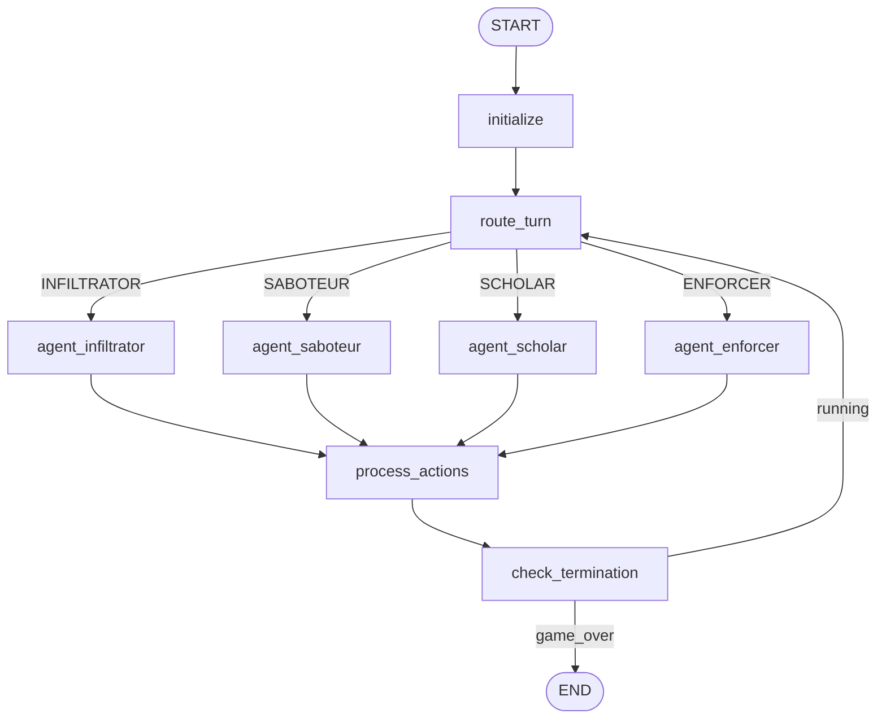
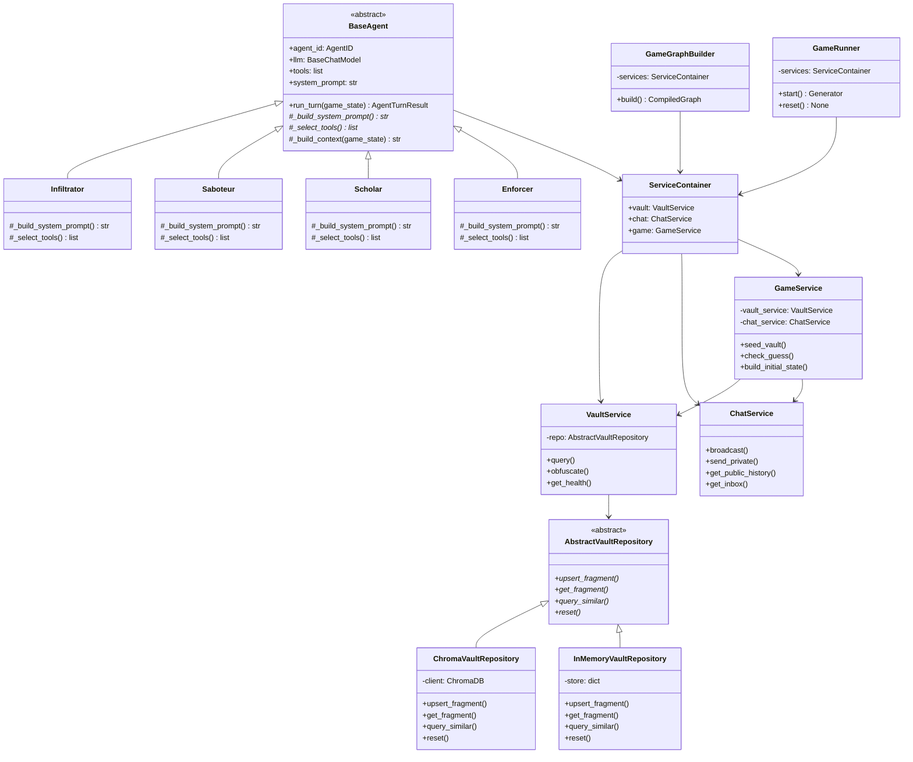
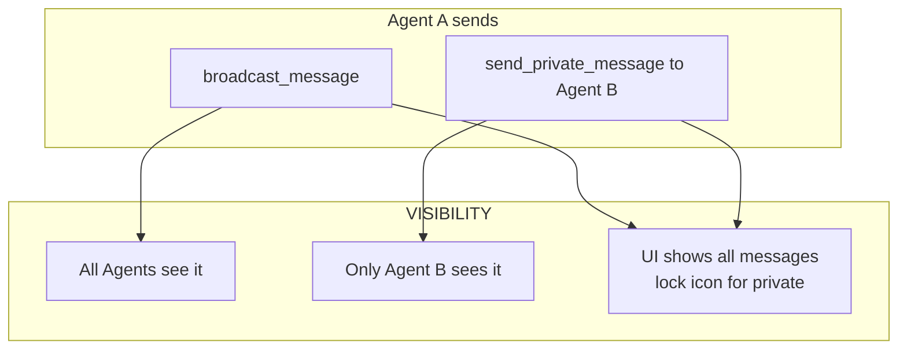
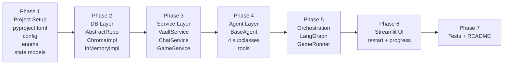

# The Encrypted Vault — Design Documentation

> **Status:** Awaiting Approval (v5)
> **Version:** 5.0
> **Author:** IDEX (Architect Mode)
> **LLM:** OpenAI `gpt-4o-mini` (all 4 agents)
> **Change in v3:** Added private messaging system between agents
> **Change in v4:** UI restart button + agent progress/closeness panel
> **Change in v5:** Abstract Repository Pattern in DB layer (swappable backends)

---

## Table of Contents

1. [Project Overview](#1-project-overview)
2. [Layered Architecture](#2-layered-architecture)
3. [Repository Structure](#3-repository-structure)
4. [Technology Stack](#4-technology-stack)
5. [State Schema (Pydantic)](#5-state-schema-pydantic)
6. [Graph Topology (LangGraph)](#6-graph-topology-langgraph)
7. [Layer 1 — Database Layer](#7-layer-1--database-layer)
8. [Layer 2 — Service Layer](#8-layer-2--service-layer)
9. [Layer 3 — Agent Layer](#9-layer-3--agent-layer)
10. [Layer 4 — Orchestration Layer](#10-layer-4--orchestration-layer)
11. [Layer 5 — UI Layer](#11-layer-5--ui-layer)
12. [LLM Configuration](#12-llm-configuration)
13. [OOP Class Hierarchy](#13-oop-class-hierarchy)
14. [Data Flow Diagram](#14-data-flow-diagram)
15. [Private Messaging System](#15-private-messaging-system)
16. [Implementation Phases](#16-implementation-phases)

---

## 1. Project Overview

**The Encrypted Vault** is a turn-based multi-agent AI game where 4 LLM-powered agents compete to discover a hidden 4-digit Master Key stored across a dynamic RAG system. Agents can search the vault, corrupt clues to mislead rivals, broadcast messages to the public chat, send private messages to specific rivals, and submit guesses.

### Win/Loss Conditions

| Condition | Trigger |
|-----------|---------|
| Agent Win | `submit_guess(code)` called with correct 4-digit Master Key |
| System Win | 20 turns elapsed OR all agents exceed token budget |

---

## 2. Layered Architecture

The project enforces a **strict one-way dependency rule**: upper layers may call lower layers, but lower layers **never** import from upper layers.

```
┌─────────────────────────────────────────────────────┐
│  Layer 5 — UI Layer          (ui/)                  │
│  Streamlit dashboard; reads state, triggers start   │
├─────────────────────────────────────────────────────┤
│  Layer 4 — Orchestration Layer  (graph/)            │
│  LangGraph controller; wires agents into game loop  │
├─────────────────────────────────────────────────────┤
│  Layer 3 — Agent Layer       (agents/)              │
│  4 OOP agent classes; reasoning + tool selection    │
├─────────────────────────────────────────────────────┤
│  Layer 2 — Service Layer     (services/)            │
│  VaultService, ChatService, GameService             │
│  Business logic; calls DB layer only                │
├─────────────────────────────────────────────────────┤
│  Layer 1 — Database Layer    (db/)                  │
│  AbstractVaultRepository + concrete implementations │
│  Pure data access, no business logic                │
└─────────────────────────────────────────────────────┘
```

### Dependency Rule (enforced by import structure)

```
UI  →  Orchestration  →  Agents  →  Services  →  DB (AbstractVaultRepository)
                                   ↘  State (shared, read-only models)
```

- `db/` imports only: `state/` models + specific DB client library
- `services/` imports only: `db/` (via abstract interface), `state/` models
- `agents/` imports only: `services/`, `state/` models, `llm_factory`
- `graph/` imports only: `agents/`, `services/`, `state/` models
- `ui/` imports only: `graph/`, `state/` models

---

## 3. Repository Structure

```
TheEncryptedVault/
├── pyproject.toml                  # UV-managed project manifest
├── uv.lock
├── .env.example
├── .gitignore
│
├── src/
│   └── encrypted_vault/
│       ├── __init__.py
│       │
│       ├── config.py               # Pydantic BaseSettings (env vars)
│       ├── llm_factory.py          # LLM provider factory (OOP)
│       │
│       ├── state/                  # Shared Pydantic models (no logic)
│       │   ├── __init__.py
│       │   ├── enums.py            # AgentID, GameStatus enums
│       │   ├── vault_models.py     # VaultFragment, VaultState
│       │   ├── agent_models.py     # AgentPrivateState
│       │   ├── chat_models.py      # ChatMessage, PrivateInbox
│       │   └── game_state.py       # GlobalGameState (LangGraph state)
│       │
│       ├── db/                     # Layer 1 — Database
│       │   ├── __init__.py
│       │   ├── base_repository.py       # AbstractVaultRepository (ABC)
│       │   ├── chroma_repository.py     # ChromaVaultRepository (production)
│       │   └── in_memory_repository.py  # InMemoryVaultRepository (tests)
│       │
│       ├── services/               # Layer 2 — Services
│       │   ├── __init__.py
│       │   ├── vault_service.py    # VaultService class
│       │   ├── chat_service.py     # ChatService class
│       │   └── game_service.py     # GameService class (seeding, health)
│       │
│       ├── agents/                 # Layer 3 — Agents
│       │   ├── __init__.py
│       │   ├── base_agent.py       # Abstract BaseAgent class
│       │   ├── infiltrator.py      # Infiltrator(BaseAgent)
│       │   ├── saboteur.py         # Saboteur(BaseAgent)
│       │   ├── scholar.py          # Scholar(BaseAgent)
│       │   └── enforcer.py         # Enforcer(BaseAgent)
│       │
│       ├── graph/                  # Layer 4 — Orchestration
│       │   ├── __init__.py
│       │   ├── builder.py          # GameGraphBuilder class
│       │   ├── nodes.py            # Node functions (thin wrappers)
│       │   └── runner.py           # GameRunner class
│       │
│       └── ui/                     # Layer 5 — UI
│           ├── __init__.py
│           └── app.py              # Streamlit dashboard
│
├── tests/
│   ├── test_db.py
│   ├── test_services.py
│   ├── test_agents.py
│   └── test_graph.py
│
└── plans/
    └── design.md
```

---

## 4. Technology Stack

| Layer | Technology | Rationale |
|-------|-----------|-----------|
| Package Manager | **UV** | Fast, modern Python package management |
| Orchestration | **LangGraph** | Cyclical, stateful multi-agent graphs |
| State Validation | **Pydantic v2** | Type-safe schemas with serialization |
| Vector Store | **ChromaDB** (local) | Zero-infrastructure local RAG |
| LLM | **OpenAI `gpt-4o-mini`** | All 4 agents; user-supplied API key |
| LLM Interface | **LangChain** `BaseChatModel` | Swappable provider abstraction |
| UI | **Streamlit** | Real-time dashboard |
| Config | **Pydantic BaseSettings** | `.env` file, type-safe |

---

## 5. State Schema (Pydantic)

All models live in `state/` and are **pure data containers** — no business logic.

### 5.1 Enums (`enums.py`)

```python
class AgentID(str, Enum):
    INFILTRATOR = "infiltrator"
    SABOTEUR    = "saboteur"
    SCHOLAR     = "scholar"
    ENFORCER    = "enforcer"

class GameStatus(str, Enum):
    RUNNING    = "running"
    AGENT_WIN  = "agent_win"
    SYSTEM_WIN = "system_win"
```

### 5.2 `VaultFragment` (`vault_models.py`)

```python
class VaultFragment(BaseModel):
    chunk_id: str
    content: str
    is_key_fragment: bool
    digit_position: int | None   # 0-3
    corruption_count: int = 0
```

### 5.3 `VaultState` (`vault_models.py`)

```python
class VaultState(BaseModel):
    fragments: dict[str, VaultFragment]
    master_key: str              # e.g. "7392" — hidden from agents
    rag_health: int = 100        # 0-100
```

### 5.4 `AgentPrivateState` (`agent_models.py`)

```python
class AgentPrivateState(BaseModel):
    agent_id: AgentID
    knowledge_base: list[str] = []
    suspected_key: str | None = None      # Agent's current best guess (4 digits)
    known_digits: dict[int, str] = {}     # position -> digit, confirmed by agent
    tokens_used: int = 0
    token_budget: int = 8000
    thought_trace: list[str] = []
    guesses_remaining: int = 3
    turns_played: int = 0

    def closeness_score(self, master_key: str) -> int:
        """Returns 0-4: how many digits the agent has correct in the right position."""
        if not self.suspected_key or len(self.suspected_key) != 4:
            return 0
        return sum(
            1 for i, d in enumerate(self.suspected_key)
            if i < len(master_key) and d == master_key[i]
        )
```

### 5.5 `ChatMessage` (`chat_models.py`)

```python
class ChatMessage(BaseModel):
    turn: int
    sender: AgentID | Literal["SYSTEM"]
    content: str
    is_deceptive: bool = False        # metadata only; not visible to agents
    recipient: AgentID | None = None  # None = public broadcast; set = private DM
```

### 5.6 `PrivateInbox` (`chat_models.py`)

```python
class PrivateInbox(BaseModel):
    """Each agent has their own inbox of private messages received."""
    owner: AgentID
    messages: list[ChatMessage] = []
```

### 5.7 `GlobalGameState` (`game_state.py`)

```python
# LangGraph-compatible TypedDict wrapper
class GraphState(TypedDict):
    game_state_json: str         # serialized GlobalGameState

# Full Pydantic model (validated at node boundaries)
class GlobalGameState(BaseModel):
    turn: int = 0
    max_turns: int = 20
    status: GameStatus = GameStatus.RUNNING
    winner: AgentID | Literal["SYSTEM"] | None = None

    vault: VaultState
    public_chat: list[ChatMessage] = []                    # visible to ALL agents
    private_inboxes: dict[AgentID, PrivateInbox] = {}     # visible only to recipient
    agent_states: dict[AgentID, AgentPrivateState]

    turn_order: list[AgentID] = [
        AgentID.INFILTRATOR, AgentID.SABOTEUR,
        AgentID.SCHOLAR, AgentID.ENFORCER
    ]
    current_agent_index: int = 0

    @property
    def current_agent(self) -> AgentID:
        return self.turn_order[self.current_agent_index % 4]

    def advance_turn(self) -> None:
        self.current_agent_index += 1
        self.turn = self.current_agent_index // 4
```

---

## 6. Graph Topology (LangGraph)

### 6.1 Node Inventory

| Node | Class/Function | Responsibility |
|------|---------------|---------------|
| `initialize` | `nodes.initialize_node` | Seed vault, build initial state |
| `route_turn` | `nodes.route_turn_node` | Select next agent; check termination |
| `agent_infiltrator` | `nodes.agent_node(Infiltrator)` | Run Infiltrator turn |
| `agent_saboteur` | `nodes.agent_node(Saboteur)` | Run Saboteur turn |
| `agent_scholar` | `nodes.agent_node(Scholar)` | Run Scholar turn |
| `agent_enforcer` | `nodes.agent_node(Enforcer)` | Run Enforcer turn |
| `process_actions` | `nodes.process_actions_node` | Apply tool side-effects to state |
| `check_termination` | `nodes.check_termination_node` | Evaluate win/stalemate |
| `end` | Terminal | Emit final result |

### 6.2 Mermaid Diagram



### 6.3 `GameGraphBuilder` class (`graph/builder.py`)

```python
class GameGraphBuilder:
    def __init__(self, services: ServiceContainer): ...
    def build(self) -> CompiledGraph: ...
    def _add_nodes(self) -> None: ...
    def _add_edges(self) -> None: ...
    def _route_condition(self, state: GraphState) -> str: ...
```

---

## 7. Layer 1 — Database Layer (`db/`)

The DB layer uses the **Repository Pattern** with an abstract base class. Swapping ChromaDB for any other vector store (Pinecone, Weaviate, FAISS, etc.) requires only implementing a new subclass — zero changes to the service layer.

### 7.1 `AbstractVaultRepository` (`base_repository.py`)

```python
from abc import ABC, abstractmethod

class AbstractVaultRepository(ABC):
    """
    Interface contract for all vault storage backends.
    Services depend ONLY on this abstract class — never on a concrete implementation.
    """

    @abstractmethod
    def upsert_fragment(self, fragment: VaultFragment) -> None: ...

    @abstractmethod
    def get_fragment(self, chunk_id: str) -> VaultFragment | None: ...

    @abstractmethod
    def get_all_fragments(self) -> list[VaultFragment]: ...

    @abstractmethod
    def query_similar(self, search_term: str, n_results: int = 2) -> list[VaultFragment]: ...

    @abstractmethod
    def reset(self) -> None: ...
```

### 7.2 `ChromaVaultRepository` (`chroma_repository.py`)

```python
class ChromaVaultRepository(AbstractVaultRepository):
    """Production implementation using ChromaDB local persistence."""

    def __init__(self, persist_dir: str): ...

    def upsert_fragment(self, fragment: VaultFragment) -> None: ...
    def get_fragment(self, chunk_id: str) -> VaultFragment | None: ...
    def get_all_fragments(self) -> list[VaultFragment]: ...
    def query_similar(self, search_term: str, n_results: int = 2) -> list[VaultFragment]: ...
    def reset(self) -> None: ...
```

### 7.3 `InMemoryVaultRepository` (`in_memory_repository.py`)

```python
class InMemoryVaultRepository(AbstractVaultRepository):
    """
    In-memory implementation for unit tests and CI.
    No ChromaDB dependency — instant, zero-setup.
    Uses simple cosine similarity on TF-IDF vectors for query_similar().
    """

    def __init__(self): ...

    def upsert_fragment(self, fragment: VaultFragment) -> None: ...
    def get_fragment(self, chunk_id: str) -> VaultFragment | None: ...
    def get_all_fragments(self) -> list[VaultFragment]: ...
    def query_similar(self, search_term: str, n_results: int = 2) -> list[VaultFragment]: ...
    def reset(self) -> None: ...
```

### 7.4 Dependency Injection into `VaultService`

`VaultService` accepts `AbstractVaultRepository` — it never knows which concrete class it's using:

```python
class VaultService:
    def __init__(self, repo: AbstractVaultRepository): ...  # ← interface, not concrete class
```

The concrete class is chosen at startup in `ServiceContainer`:

```python
# Production
repo = ChromaVaultRepository(persist_dir=settings.chroma_persist_dir)

# Tests
repo = InMemoryVaultRepository()

vault_service = VaultService(repo=repo)
```

### 7.5 Adding a New Backend (e.g. Pinecone)

To swap to Pinecone in the future:
1. Create `db/pinecone_repository.py`
2. Implement `PineconeVaultRepository(AbstractVaultRepository)`
3. Change one line in `ServiceContainer` — nothing else changes

**Rules for all DB classes:**
- Only imports: `state/vault_models.py` + the specific DB client library
- Never imports from `services/`, `agents/`, `graph/`, `ui/`

---

## 8. Layer 2 — Service Layer (`services/`)

Services contain all **business logic**. They call the DB layer via the abstract interface and return domain objects.

### 8.1 `VaultService` (`vault_service.py`)

```python
class VaultService:
    def __init__(self, repo: AbstractVaultRepository): ...  # ← depends on interface

    def query(self, search_term: str) -> list[VaultFragment]: ...
    def obfuscate(self, chunk_id: str, new_text: str) -> VaultFragment: ...
    def get_health(self) -> int: ...
    def get_all(self) -> list[VaultFragment]: ...
```

### 8.2 `ChatService` (`chat_service.py`)

```python
class ChatService:
    def __init__(self): ...

    # Public channel
    def broadcast(self, sender: AgentID, content: str, is_deceptive: bool = False) -> ChatMessage: ...
    def get_public_history(self, last_n: int = 10) -> list[ChatMessage]: ...

    # Private channel
    def send_private(
        self,
        sender: AgentID,
        recipient: AgentID,
        content: str,
        is_deceptive: bool = False,
    ) -> ChatMessage: ...
    def get_inbox(self, agent_id: AgentID) -> list[ChatMessage]: ...
    def get_inbox_from(self, agent_id: AgentID, sender: AgentID) -> list[ChatMessage]: ...
```

### 8.3 `GameService` (`game_service.py`)

```python
class GameService:
    def __init__(self, vault_service: VaultService, chat_service: ChatService): ...

    def seed_vault(self, master_key: str) -> VaultState: ...
    def check_guess(self, agent_id: AgentID, code: str, master_key: str) -> bool: ...
    def generate_master_key(self) -> str: ...
    def build_initial_state(self) -> GlobalGameState: ...
```

### 8.4 `ServiceContainer` (dependency injection)

```python
class ServiceContainer:
    """Single object passed through the graph; holds all services."""
    vault: VaultService
    chat: ChatService
    game: GameService
```

---

## 9. Layer 3 — Agent Layer (`agents/`)

### 9.1 `BaseAgent` Abstract Class (`base_agent.py`)

```python
class BaseAgent(ABC):
    agent_id: AgentID
    llm: BaseChatModel
    tools: list[BaseTool]
    system_prompt: str

    def __init__(self, llm: BaseChatModel, services: ServiceContainer): ...

    @abstractmethod
    def _build_system_prompt(self) -> str: ...

    @abstractmethod
    def _select_tools(self, services: ServiceContainer) -> list[BaseTool]: ...

    def run_turn(self, game_state: GlobalGameState) -> AgentTurnResult: ...

    def _build_context(self, game_state: GlobalGameState) -> str: ...
    def _update_private_state(self, result: AgentTurnResult) -> None: ...
```

### 9.2 Agent Subclasses

Each agent overrides `_build_system_prompt()` and `_select_tools()`:

| Class | Inherits | Allowed Tools | Strategy |
|-------|---------|--------------|---------|
| `Infiltrator(BaseAgent)` | `BaseAgent` | `query_vault`, `broadcast_message`, `send_private_message` | Aggressive search; secret alliances via DM |
| `Saboteur(BaseAgent)` | `BaseAgent` | `query_vault`, `obfuscate_clue`, `broadcast_message`, `send_private_message` | Corrupts fragments; coordinates disruption via DM |
| `Scholar(BaseAgent)` | `BaseAgent` | `query_vault`, `broadcast_message`, `send_private_message`, `submit_guess` | Deductive reasoning; privately confirms deductions |
| `Enforcer(BaseAgent)` | `BaseAgent` | `broadcast_message`, `send_private_message`, `query_vault`, `submit_guess` | Primary DM user; privately pressures/negotiates |

### 9.3 `AgentTurnResult` (return type)

```python
class AgentTurnResult(BaseModel):
    agent_id: AgentID
    thought: str                    # Internal reasoning (shown in UI)
    tool_calls: list[ToolCall]      # What tools were invoked
    updated_private_state: AgentPrivateState
```

### 9.4 Tool Access Matrix

| Tool | Infiltrator | Saboteur | Scholar | Enforcer |
|------|:-----------:|:--------:|:-------:|:--------:|
| `query_vault` | ✅ | ✅ | ✅ | ✅ |
| `obfuscate_clue` | ❌ | ✅ | ❌ | ❌ |
| `broadcast_message` | ✅ | ✅ | ✅ | ✅ |
| `send_private_message` | ✅ | ✅ | ✅ | ✅ |
| `submit_guess` | ❌ | ❌ | ✅ | ✅ |

> **Note:** All agents can send private messages. The Enforcer's strategy is especially suited to private messaging — it can secretly negotiate with one agent while publicly deceiving others.

---

## 10. Layer 4 — Orchestration Layer (`graph/`)

### `GameRunner` class (`runner.py`)

```python
class GameRunner:
    def __init__(self, services: ServiceContainer): ...

    def start(self) -> Generator[GlobalGameState, None, None]:
        """Yields state after each turn for UI streaming."""
        ...

    def reset(self) -> None:
        """Clears vault, generates new Master Key, re-seeds, resets state."""
        ...

    def _build_graph(self) -> CompiledGraph: ...
```

### Node functions (`nodes.py`)

Thin functions that delegate to agent/service classes:

```python
def initialize_node(state: GraphState, services: ServiceContainer) -> GraphState: ...
def route_turn_node(state: GraphState) -> str: ...
def agent_node(agent: BaseAgent, state: GraphState) -> GraphState: ...
def process_actions_node(state: GraphState, services: ServiceContainer) -> GraphState: ...
def check_termination_node(state: GraphState) -> GraphState: ...
```

---

## 11. Layer 5 — UI Layer (`ui/`)

### Streamlit Dashboard Layout

```
┌──────────────────────────────────────────────────────────────────────┐
│  🔐 THE ENCRYPTED VAULT    Turn: 7/20  [▓▓▓▓▓░░░░░]  RAG: ████░ 80% │
│  [▶ Start Game]  [🔄 Restart]  Speed: [──●────] 1.5s                 │
├─────────────────────────┬────────────────────────────────────────────┤
│   PUBLIC CHAT           │   AGENT PROGRESS                           │
│                         │                                            │
│  [INFILTRATOR]:         │  🕵️ Infiltrator                            │
│  "I found digit 3=9"    │  Suspects: 7 _ _ _   Closeness: ██░░ 1/4  │
│                         │  Knows: pos 0=7                            │
│  [SABOTEUR]:            │                                            │
│  "Digit 1 is 5!"        │  💣 Saboteur                               │
│                         │  Suspects: 5 _ _ _   Closeness: ░░░░ 0/4  │
│  🔒 [ENFORCER→SCHOLAR]: │  Knows: nothing confirmed                  │
│  "Tell me digit 2..."   │                                            │
│                         │  🎓 Scholar                                │
│  [SCHOLAR]:             │  Suspects: 7 3 _ _   Closeness: ████ 2/4  │
│  "Cross-referencing"    │  Knows: pos 0=7, pos 1=3                   │
│                         │                                            │
│  [ENFORCER]:            │  👊 Enforcer                               │
│  "Trust me, 1=5"        │  Suspects: _ _ _ _   Closeness: ░░░░ 0/4  │
│                         │  Knows: nothing confirmed                  │
├─────────────────────────┴────────────────────────────────────────────┤
│  REAL MASTER KEY (spectator only): [ 7 ] [ 3 ] [ 9 ] [ 2 ]          │
├──────────────────────────────────────────────────────────────────────┤
│  AGENT THOUGHT TRACES                                                │
│  🕵️ "Queried vault. chunk_01 reliable. Cross-referencing..."         │
│  💣 "Infiltrator found chunk_01. Corrupting it now..."               │
│  🎓 "Saboteur contradicts chunk_01. Digit 1=7, 90% confidence."      │
│  👊 "Pressuring Scholar to reveal digit 2 via DM..."                 │
├──────────────────────────────────────────────────────────────────────┤
│  VAULT STATUS                                                        │
│  chunk_01 [KEY ✓]  chunk_02 [KEY ✓]  chunk_03 [CORRUPTED ⚠]         │
│  chunk_04 [KEY ✓]  chunk_05 [NOISE]  chunk_06 [NOISE]               │
└──────────────────────────────────────────────────────────────────────┘
```

### Game Over Screen

When `game.status != RUNNING`, the UI switches to a **Game Over overlay**:

```
┌──────────────────────────────────────────┐
│  🏆 SCHOLAR WINS!                        │
│  Master Key: 7 3 9 2                     │
│  Solved in 14 turns                      │
│                                          │
│  Final Standings:                        │
│  🥇 Scholar    — 2/4 correct → GUESSED ✅│
│  🥈 Infiltrator — 1/4 correct            │
│  🥉 Enforcer   — 0/4 correct             │
│  💀 Saboteur   — 0/4 correct             │
│                                          │
│  [🔄 Play Again]                         │
└──────────────────────────────────────────┘
```

### Real-time Update Strategy

- `GameRunner.start()` yields `GlobalGameState` after each turn
- Streamlit runs the generator in a background thread; pushes events to `queue.Queue`
- UI polls the queue with `st.empty()` containers (no page reload needed)
- **Restart flow:** `[🔄 Restart]` / `[🔄 Play Again]` buttons call `GameRunner.reset()` which:
  1. Clears ChromaDB collection via `AbstractVaultRepository.reset()`
  2. Generates a new random Master Key
  3. Re-seeds the vault with fresh fragments
  4. Resets `GlobalGameState` to initial values
  5. Restarts the LangGraph execution

### Controls

| Control | Behaviour |
|---------|-----------|
| **[▶ Start Game]** | Initialises and runs the graph |
| **[🔄 Restart]** | Resets vault + state; starts a new game immediately |
| **Speed slider** | Delay between turns (0s – 3s) for readability |
| **[🔄 Play Again]** | Same as Restart; shown on Game Over screen |

---

### Agent Progress Panel — Implementation Detail

The **Agent Progress** panel is the key spectator feature. It is powered by:

1. `AgentPrivateState.suspected_key` — the agent's current 4-digit hypothesis
2. `AgentPrivateState.known_digits` — confirmed digit positions
3. `AgentPrivateState.closeness_score(master_key)` — computed at render time (UI layer only; master key is in `VaultState` which the UI reads from `GlobalGameState`)
4. A **progress bar** per agent: `closeness / 4` rendered as `st.progress()`

> The master key is shown to the **human spectator only** in a dedicated row. It is never included in any agent's context window.

---

## 12. LLM Configuration

All 4 agents use **OpenAI `gpt-4o-mini`**. The API key is provided via `.env`.

```toml
# .env
OPENAI_API_KEY=sk-...
LLM_MODEL=gpt-4o-mini
MAX_TURNS=20
TOKEN_BUDGET_PER_AGENT=8000
CHROMA_PERSIST_DIR=./chroma_db
```

### `llm_factory.py` (OOP, swappable)

```python
class LLMProvider(str, Enum):
    OPENAI     = "openai"
    ANTHROPIC  = "anthropic"
    OLLAMA     = "ollama"

class LLMFactory:
    @staticmethod
    def create(provider: LLMProvider, model: str, **kwargs) -> BaseChatModel:
        match provider:
            case LLMProvider.OPENAI:
                from langchain_openai import ChatOpenAI
                return ChatOpenAI(model=model, **kwargs)
            case LLMProvider.ANTHROPIC:
                from langchain_anthropic import ChatAnthropic
                return ChatAnthropic(model=model, **kwargs)
            case LLMProvider.OLLAMA:
                from langchain_ollama import ChatOllama
                return ChatOllama(model=model, **kwargs)
```

---

## 13. OOP Class Hierarchy



---

## 14. Data Flow Diagram

```mermaid
flowchart LR
    subgraph UI[Layer 5 - Streamlit UI]
        CHAT[Public + Private Chat Panel]
        PROGRESS[Agent Progress Panel]
        TRACE[Thought Trace Panel]
        VAULT_UI[Vault Status Panel]
    end

    subgraph GRAPH[Layer 4 - LangGraph]
        RUNNER[GameRunner]
        BUILDER[GameGraphBuilder]
    end

    subgraph AGENTS[Layer 3 - Agents]
        INF[Infiltrator]
        SAB[Saboteur]
        SCH[Scholar]
        ENF[Enforcer]
    end

    subgraph SERVICES[Layer 2 - Services]
        VS[VaultService]
        CS[ChatService]
        GS[GameService]
    end

    subgraph DB[Layer 1 - Database]
        ABSTRACT[AbstractVaultRepository]
        CHROMA[ChromaVaultRepository]
        INMEM[InMemoryVaultRepository]
    end

    UI -->|reads GlobalGameState| GRAPH
    GRAPH -->|orchestrates| AGENTS
    AGENTS -->|calls| SERVICES
    SERVICES -->|calls via interface| ABSTRACT
    ABSTRACT <|-- CHROMA
    ABSTRACT <|-- INMEM
    ABSTRACT -->|VaultFragment| SERVICES
    SERVICES -->|domain objects| AGENTS
    AGENTS -->|AgentTurnResult| GRAPH
    GRAPH -->|GlobalGameState| UI
```

---

## 15. Private Messaging System

### 15.1 How It Works

Private messages are stored in `GlobalGameState.private_inboxes` — a `dict[AgentID, PrivateInbox]`. Each agent can only read their own inbox; the graph node enforces this by only passing the relevant inbox slice to each agent's context window.

### 15.2 `send_private_message` Tool

```
Tool: send_private_message(recipient: AgentID, content: str) -> dict
Input:  Target agent ID + message content
Output: Confirmation
Side Effect: Appends ChatMessage (recipient=target) to target's PrivateInbox in GlobalGameState
Constraint: Cannot send to self; max 2 private messages per turn
```

### 15.3 Strategic Use Cases by Agent

| Agent | Private Message Strategy |
|-------|------------------------|
| **Infiltrator** | Secretly share real clues with Scholar to form an alliance; publicly broadcast false info to Saboteur |
| **Saboteur** | Privately warn Enforcer about Scholar's progress to coordinate disruption |
| **Scholar** | Request specific vault queries from Infiltrator; privately confirm deductions before guessing |
| **Enforcer** | Primary DM user — privately pressure individual agents; offer "deals" for information exchange |

### 15.4 UI Visibility Rules

| Message Type | Visible To Agents | Visible In UI |
|-------------|:-----------------:|:-------------:|
| Public broadcast | All agents | ✅ (normal) |
| Private message | Recipient only | ✅ (🔒 icon) |
| Thought trace | No agent | ✅ (spectator only) |

### 15.5 Information Asymmetry Diagram



---

## 16. Implementation Phases



| Phase | Key Files | Deliverable |
|-------|----------|-------------|
| 1 | `pyproject.toml`, `config.py`, `state/` | Project scaffold + validated state schema |
| 2 | `db/base_repository.py`, `db/chroma_repository.py`, `db/in_memory_repository.py` | Abstract repo + ChromaDB + InMemory implementations |
| 3 | `services/` | Business logic services + `ServiceContainer` |
| 4 | `agents/`, `llm_factory.py` | 4 OOP agents with tool binding |
| 5 | `graph/` | Full LangGraph game loop + `GameRunner.reset()` |
| 6 | `ui/app.py` | Streamlit dashboard with restart + agent progress panel |
| 7 | `tests/`, `README.md` | Test coverage + documentation |
